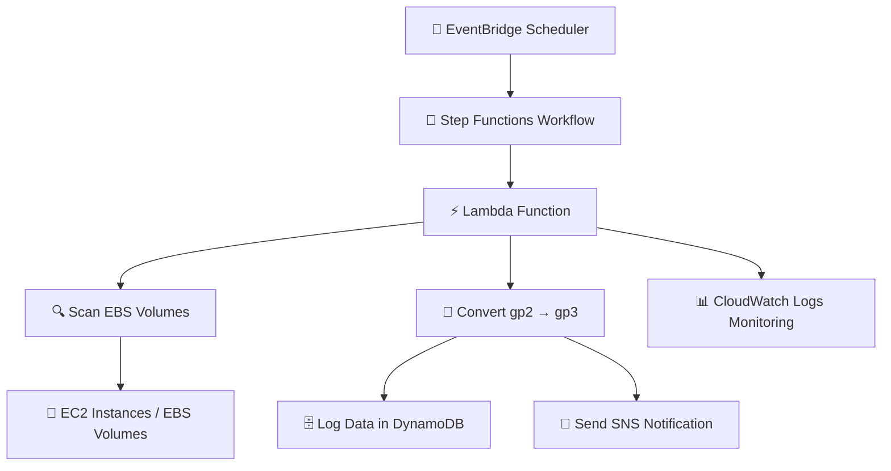

# 🚀 AWS EBS Auto Optimization System


---

## 📝 Short Description

⚡ Serverless AWS automation pipeline that scans EBS gp2 volumes and converts them to gp3 for cost optimization. Uses EventBridge, Step Functions, Lambda, DynamoDB, SNS & CloudWatch for monitoring, logging & notifications.

---

## 📚 Table of Contents

1. [Project Overview](#project-overview)  
2. [Objective / Goal](#objective--goal)  
3. [Architecture Diagram](#architecture-diagram)  
4. [Mermaid Architecture Diagram](#mermaid-architecture-diagram)  
5. [Technologies Used](#technologies-used)  
6. [Workflow / How it Works](#workflow--how-it-works)  
7. [Installation / Setup Instructions](#installation--setup-instructions)  
8. [Screenshots / Demo](#screenshots--demo)  
9. [Project Structure](#project-structure)  
10. [Security Best Practices](#security-best-practices)  
11. [Challenges & Solutions](#challenges--solutions)  
12. [Future Improvements / Roadmap](#future-improvements--roadmap)  
13. [Conclusion / Takeaways](#conclusion--takeaways)  
14. [Author / Contact](#author--contact)  
15. [References / Resources](#references--resources)  

---

## 📌 Project Overview

Modern AWS environments often contain many EBS volumes that are **not optimized**. Many workloads still use **gp2 volumes**, which are more costly and less flexible compared to **gp3**.

This project builds a **serverless, event-driven automation pipeline** to:

- Scan EBS volumes automatically  
- Identify gp2 volumes with tag `AutoConvert=true`  
- Convert them to gp3  
- Log changes in DynamoDB  
- Send notifications via SNS  
- Monitor execution with CloudWatch  

This solution demonstrates **automation, serverless architecture, and cloud cost optimization**.  

---

## 🎯 Objective / Goal

- Automatically detect and convert EBS gp2 volumes to gp3  
- Reduce AWS storage costs ⚡  
- Improve volume performance  
- Provide complete logging and auditing  
- Send real-time notifications 📢  
- Demonstrate serverless, event-driven AWS workflows  

---


## 🗂️ Mermaid Architecture Diagram



---

## 🛠️ Technologies Used

- **AWS EventBridge** – Scheduled workflow trigger ⏰  
- **AWS Step Functions** – Workflow orchestration 🔄  
- **AWS Lambda** – Serverless automation logic ⚡  
- **Amazon DynamoDB** – Logging and tracking 🗄️  
- **Amazon SNS** – Notifications 📢  
- **Amazon CloudWatch** – Monitoring and logs 📊  
- **Amazon EC2 / EBS** – Target volumes 💾  

---

## ⚙️ Workflow / How it Works

1️⃣ **Scheduled Execution** – EventBridge triggers Step Functions  
2️⃣ **Filter Volumes** – Lambda identifies gp2 volumes with `AutoConvert=true`  
3️⃣ **Log Volume Details** – DynamoDB stores metadata (VolumeId, InstanceId, OldType, NewType, Size, Region, Timestamp)  
4️⃣ **Convert Volume Type** – Lambda uses EC2 API to change gp2 → gp3  
5️⃣ **Verification (Optional)** – Use DescribeVolumeModifications  
6️⃣ **Send Notification** – SNS publishes an email alert  
7️⃣ **Monitoring** – CloudWatch logs Lambda execution and workflow status  

---

## ⚙️ Installation / Setup Instructions

1. Clone the repository:  
```bash
git clone https://github.com/Prasad-bhoite19/aws-ebs-auto-optimization.git
```

2. Deploy Lambda function in your preferred AWS region  
3. Create DynamoDB table: `EBSVolumeConversionLog`  
4. Create SNS topic and subscribe your email  
5. Create Step Function and paste workflow JSON  
6. Create EventBridge scheduled rule and connect to Step Function  
7. Confirm SNS email subscription  
8. Test the workflow and check logs in CloudWatch  

---

## 📸 Screenshots / Demo

- **Step Function Execution Flow** – `screenshots/step-function-execution.png`  
- **DynamoDB Log Entries** – `screenshots/dynamodb-logs.png`  
- **SNS Notification Message** – `screenshots/sns-notification.png`  
- **CloudWatch Logs** – `screenshots/cloudwatch-logs.png`  

---

## 📁 Project Structure

```
ebs-volume-optimization
│
├── lambda_function.py
├── step_function_definition.json
├── architecture-diagram.png
├── screenshots/
│   ├── step-function-execution.png
│   ├── dynamodb-logs.png
│   ├── sns-notification.png
│   └── cloudwatch-logs.png
└── README.md
```

---

## 🔒 Security Best Practices

- IAM **least privilege roles** for Lambda  
- No hardcoded credentials 🔑  
- Resource-level access control (specific DynamoDB table, SNS topic)  
- CloudWatch monitoring and logging for auditing 📊  

---

## ⚡ Challenges & Solutions

- **SNS Email Not Received** – Confirmed subscription  
- **Invalid SNS ARN** – Corrected ARN in Lambda  
- **DynamoDB Logging Failure** – Corrected table reference  

---

## 🌟 Future Improvements / Roadmap

- Multi-region support 🌍  
- Slack / Teams notifications 💬  
- Terraform infrastructure automation 🛠️  
- Cost & performance dashboards 📊  
- Integration with AWS Config for compliance  

---

## ✅ Conclusion / Takeaways

This project demonstrates **serverless automation, AWS cost optimization, and event-driven workflows**.  

Skills learned:

- AWS Lambda, Step Functions, EventBridge  
- DynamoDB logging  
- SNS notifications  
- CloudWatch monitoring  
- Real-world DevOps & Cloud automation practices 🚀  

---

## 👤 Author 
### Prasad Bhoite
Cloud & DevOps Automation Project 

## 📩 Connect With Me :-

If you’d like to collaborate, discuss projects, or just say hello — feel free to reach out!  

### 🔗 Social & Professional Links
- 🌐 [Portfolio Website](https://prasad-bhoite19.github.io/prasad-portfolio/)  
- 💼 [LinkedIn](http://linkedin.com/in/prasad-bhoite-a38a64223)  
- 🐙 [GitHub](https://github.com/Prasad-bhoite19)  
- ✉️ [Email](prasadsb2002@gmail.com)   

---

## 📖 References / Resources

- [AWS Lambda Documentation](https://docs.aws.amazon.com/lambda/)  
- [AWS Step Functions Documentation](https://docs.aws.amazon.com/step-functions/)  
- [Amazon EBS Documentation](https://docs.aws.amazon.com/ebs/)  
- [AWS SNS Documentation](https://docs.aws.amazon.com/sns/)  
- [AWS DynamoDB Documentation](https://docs.aws.amazon.com/dynamodb/)  
